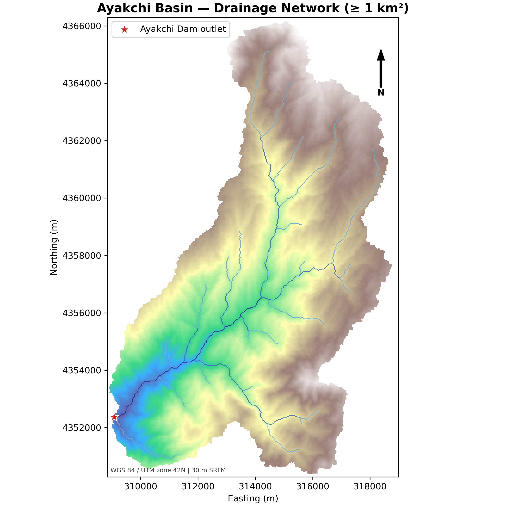
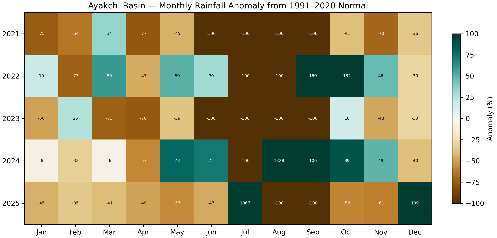
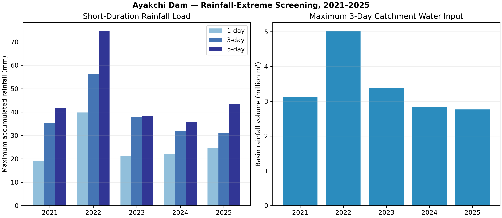
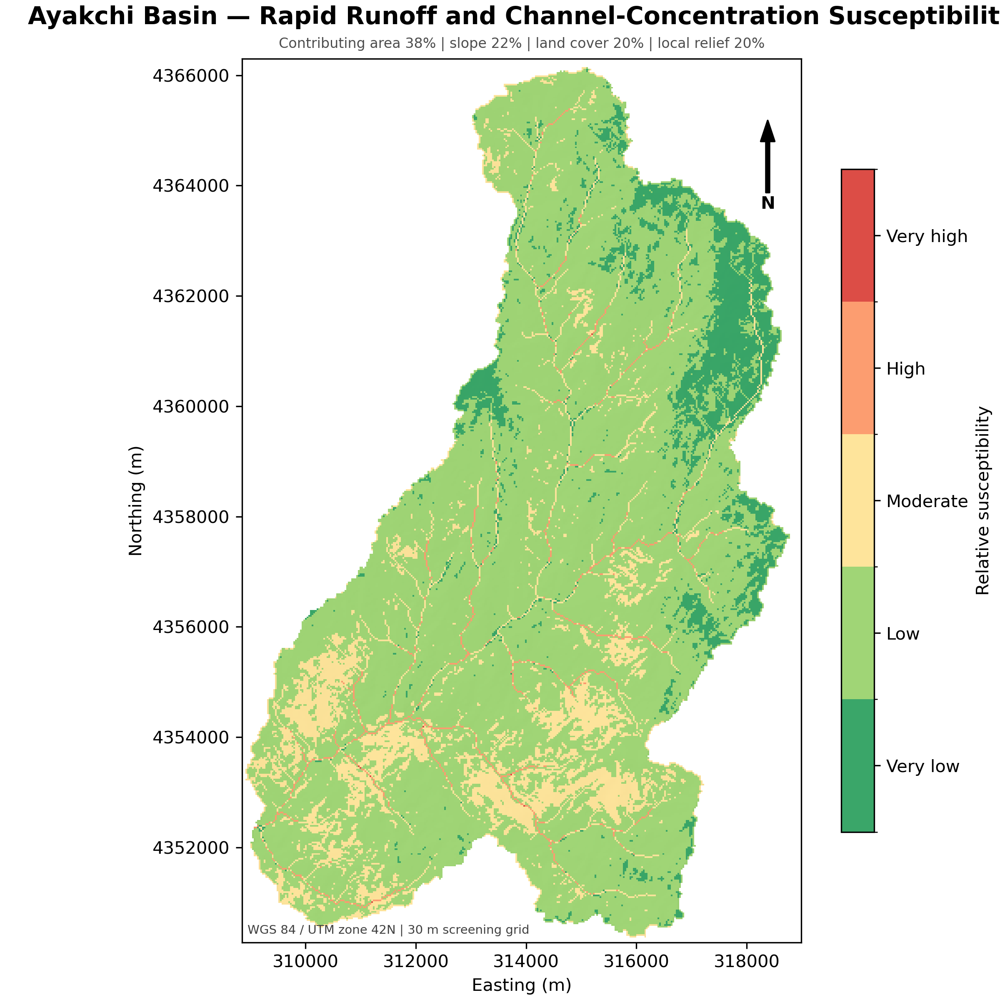
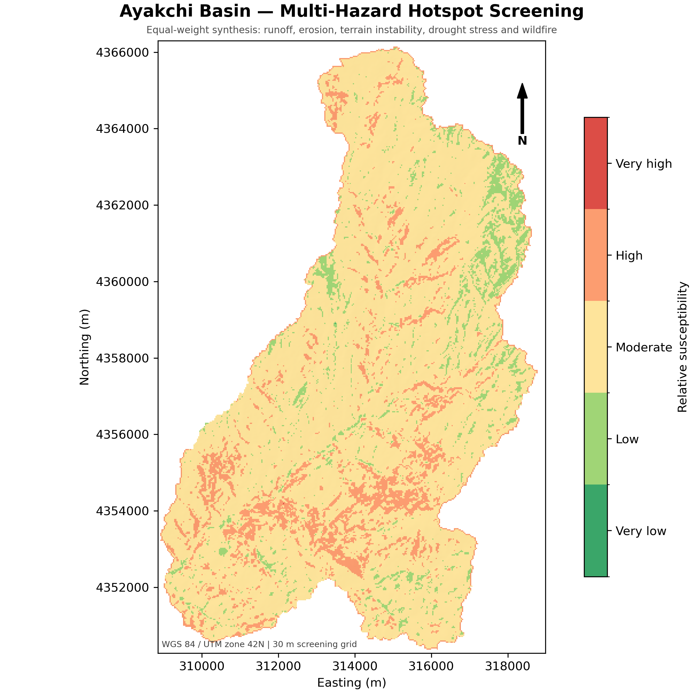

# Ayakchi Climate Information and Early Warning System

## Technical reference report for stakeholder mapping and vision setting

**Status:** Draft for consultation  
**Purpose:** Reference document for preparation of the CIEWS stakeholder workshop and presentation  
**Study area:** Ayakchi dam catchment, connected downstream basin, and 5 km contextual buffer  
**Date:** 5 August 2026

---

## Executive summary

The proposed Climate Information and Early Warning System (CIEWS) is needed to convert fragmented climate, hydrological, reservoir, satellite, and community information into timely decisions. It should initially support seasonal water planning, drought awareness, heavy-rainfall and rapid-runoff monitoring, snowmelt awareness, reservoir situation monitoring, downstream warning, and coordinated public communication.

The current analysis provides a screening-level evidence base for defining the system. The confirmed Ayakchi dam drains an upstream catchment of approximately **89.1 km²**. The connected drainage system from the upper catchment through the dam to the city-facing outlet covers approximately **372.8 km²**. The mapped flow path below the dam is approximately **47.9 km**, descending about **340 m**. Approximately **283.5 km²**, or **76% of the connected drainage area**, lies below the dam. Rainfall and runoff generated by downstream tributaries may therefore be as important to downstream conditions as releases from the reservoir.

The 5 km contextual buffer expands the study area to approximately **1,051.5 km²**. Global screening datasets indicate approximately **106,800 people** in this contextual area, about **20,900** within the connected basin, and about **27,000** within a 2 km corridor around the mapped dam-to-outlet flow path. These are planning estimates, not counts of population at flood risk. The river corridor is strongly occupied: ESA WorldCover indicates approximately **49.9% cropland** and **9.2% built land**, emphasizing the importance of agriculture, settlements, irrigation, roads, water services, and community warning in CIEWS design.

Recent climate screening indicates high variability. Mean annual CHIRPS rainfall for 2021–2025 was approximately **328 mm**, compared with a 1991–2020 normal of approximately **421 mm**. The driest recent years, 2021 and 2023, received approximately **243–244 mm**. The wettest recent year, 2022, received approximately **449 mm** and produced the largest recent three-day rainfall total, about **56.3 mm**. The short five-year record is insufficient for design probabilities, but it demonstrates the operational need to manage both water scarcity and intense rainfall.

Terrain and susceptibility screening identifies material erosion, terrain-instability, drought-stress, wildfire, and snowmelt-runoff concerns. These maps are relative prioritization products—not calibrated hazard probabilities, forecasts, flood depths, or engineering design outputs. Their role is to focus monitoring, data collection, field validation, and institutional discussion.

The recommended CIEWS is a phased service, not only a dashboard or equipment procurement. Its minimum operational chain is:

> observation and forecast → automated quality control → technical analysis → decision threshold → authorized warning → multi-channel dissemination → protective action → feedback and improvement

The stakeholder workshop should seek government agreement on the priority hazards and decisions, lead coordinating institution, technical producers, warning authority, initial users, pilot coverage, minimum data-sharing commitments, and phased implementation priorities. These decisions are prerequisites for a detailed system specification.

---

## 1. Purpose and status of this report

This report consolidates the existing Ayakchi spatial and hydroclimatic analysis into a reference for the proposed **CIEWS Stakeholder Mapping and Vision Setting** workshop. It is intended to:

- provide a common technical baseline;
- explain why CIEWS is needed and which decisions it should support;
- connect preliminary findings to users, products, and operational responsibilities;
- identify decisions that must be made by government stakeholders;
- define a realistic phased implementation pathway; and
- identify evidence gaps for subsequent technical work.

This is a concept and screening report. It does not constitute a dam-safety assessment, design-flood study, dam-break analysis, flood-inundation model, final warning-threshold study, or procurement specification.

### 1.1 Analytical basis

The report draws on:

- 30 m terrain and hydromorphological analysis;
- delineation of the upstream catchment and connected downstream drainage system;
- CHIRPS rainfall and ERA5-Land climate and runoff proxies;
- Sentinel-2 environmental indices;
- MODIS historical snow observations;
- Dynamic World and ESA WorldCover land-cover products;
- JRC Global Surface Water;
- GHSL built-surface data;
- WorldPop indicative population estimates; and
- preliminary multi-hazard susceptibility screening.

The global and satellite products should be verified using local station records, field observations, asset registers, settlement data, community knowledge, and the final dam design and operating information.

---

## 2. Why CIEWS is needed

### 2.1 Climate and water-management problem

Ayakchi combines a relatively small, elevated upstream catchment with a much larger connected downstream system and an intensively used agricultural and settlement corridor. Water managers and communities must deal with several linked challenges:

- large year-to-year rainfall variability;
- prolonged seasonal dryness and potential drought stress;
- short-duration heavy rainfall and concentrated runoff;
- seasonal snow accumulation and melt in upper terrain;
- erosion and slope-instability pressures;
- reservoir inflow, storage, release, and spillway decisions;
- additional runoff entering below the dam;
- exposure of settlements, agriculture, roads, irrigation systems, and water infrastructure; and
- fragmented information, responsibilities, and communication channels.

The reservoir can improve water management, but it also creates a need for coordinated observation and communication. Reservoir information alone is insufficient because approximately 76% of the connected basin area lies downstream of the dam. A useful CIEWS must integrate conditions above the reservoir, at the dam, along downstream tributaries, and among exposed users.

### 2.2 Current information gaps

The available analysis reveals the setting but not yet the operational thresholds. The principal gaps are:

- incomplete inventory and assessment of existing hydrometeorological stations;
- limited access to long, quality-controlled hourly rainfall, river-stage, discharge, snow, and soil-moisture records;
- absence of a shared real-time reservoir and catchment situation view;
- insufficient documented relationships among rainfall, inflow, reservoir level, release, downstream level, and impact;
- no validated flood-arrival times or inundation depths;
- limited georeferenced inventories of historical floods, droughts, erosion, landslides, losses, and response actions;
- incomplete settlement, infrastructure, irrigation, and critical-facility exposure data;
- unclear or undocumented operational thresholds and warning authority;
- uncertain interoperability and data-sharing arrangements; and
- a need to validate last-mile communication and community response procedures.

### 2.3 Decisions CIEWS should support

| Decision horizon | Decisions to support | Example information required |
|---|---|---|
| Seasonal: 1–6 months | Water allocation, cropping expectations, drought preparedness, reservoir seasonal strategy | Seasonal outlook, snow status, rainfall anomaly, soil moisture, storage, demand scenario |
| Weekly: 1–4 weeks | Irrigation scheduling, maintenance planning, readiness level, monitoring priorities | Recent rainfall, forecast tendency, soil moisture, vegetation condition, reservoir trend |
| Short range: 1–7 days | Reservoir preparation, field operations, agency readiness, public advisories | Weather forecast, catchment wetness, snowmelt conditions, expected inflow and tributary response |
| Event: minutes–24 hours | Release decisions, warning issuance, road or canal actions, protective community response | Gauge and reservoir telemetry, rainfall nowcast, threshold status, forecast hydrograph, verified field reports |
| Post-event | Damage assessment, threshold review, recovery priorities, system learning | Archived observations, warning log, observed impacts, user feedback, satellite event mapping |

### 2.4 Proposed CIEWS objective

The proposed objective is:

> To provide trusted, timely, and actionable climate, water, reservoir, and hazard information that enables government institutions, operators, service providers, farmers, and communities to anticipate conditions, coordinate decisions, issue warnings, and reduce avoidable losses.

---

## 3. Ayakchi dam and study-area context

### 3.1 Nested analytical areas

The analysis distinguishes six areas so that upstream hydrology is not confused with downstream exposure:

| Area | Approximate size | Primary purpose |
|---|---:|---|
| Upstream dam catchment | 89.1 km² | Rainfall-runoff, snow, erosion, drought, and reservoir-inflow context |
| Incremental downstream area | 283.5 km² hydrologically; 284.0 km² vector estimate | Tributary inflow and downstream land-use context |
| Connected basin | 372.8 km² | Integrated upstream–dam–downstream drainage system |
| 5 km buffer ring | 678.8 km² | Nearby settlements, agriculture, roads, institutions, and contextual users |
| 2 km river corridor | 174.8 km² | Preliminary settlement and asset screening near the mapped flow path |
| Total contextual study area | 1,051.5 km² | Stakeholder and regional land-use context |

The 5 km buffer and 2 km corridor are **not flood or dam-break boundaries**. They are planning areas used to avoid excluding nearby settlements, facilities, and infrastructure from stakeholder mapping.


*Figure 1. ESA WorldCover benchmark with the upstream catchment, connected basin, contextual buffer, and dam-to-outlet flow path.*

### 3.2 Upstream terrain and drainage

The upstream catchment rises from approximately **860 m** at the outlet to about **2,068 m**, with a mean elevation of approximately **1,538 m** and total relief of about **1,208 m**. The main analytical flow path is approximately **19.2 km**. At a 1 km² stream-extraction threshold, the mapped network contains approximately **66.6 km** of channels and reaches Strahler order 3.

The combination of relief, tributary structure, and a compact response area supports attention to localized heavy rainfall, channel concentration, erosion, and seasonal snowmelt. The conditioned DEM is an analytical routing surface and should not be treated as surveyed ground geometry.



*Figure 2. Preliminary upstream drainage network and main flow path.*

### 3.3 Connected downstream system

The connected basin analysis extends from headwaters through the dam to the city-facing outlet. The mapped downstream path is approximately **47.9 km**, with an elevation decline of approximately **340 m** and an average path gradient of approximately **0.71%**.

The most important planning result is the scale of downstream tributary contribution. The contributing area at the dam is approximately **89.3 km²**, while the incremental area below the dam is approximately **283.5 km²**. Downstream monitoring and warning cannot therefore rely only on dam release data.


*Figure 3. Connected drainage system from the upstream catchment through the dam to the downstream outlet.*


*Figure 4. Analytical dam-to-outlet longitudinal profile. Elevations are DEM-derived and are not a surveyed channel profile.*

### 3.4 Land use, settlements, and exposure context

ESA WorldCover provides the most stable benchmark for the current screening. Dynamic World was also evaluated, but its 2025 seasonal mode classified substantially more dry terrain as built land than ESA WorldCover and GHSL. Dynamic World should not be used alone to quantify urban area without local validation.

| Zone | Grass | Crops | Built | Indicative population (2020) |
|---|---:|---:|---:|---:|
| Upstream catchment | 98.0% | 0.2% | <0.1% | 1,609 |
| Incremental downstream area | 35.5% | 59.5% | 4.1% | 19,301 |
| Connected basin | 50.4% | 45.4% | 3.2% | 20,901 |
| 5 km buffer ring | 56.3% | 35.5% | 5.8% | 85,874 |
| 2 km river corridor | 38.8% | 49.9% | 9.2% | 27,017 |
| Total study area | 54.2% | 39.0% | 4.8% | 106,776 |

The higher concentration of cropland and built land in the downstream corridor indicates that CIEWS products must serve more than dam operators. Agricultural users, settlement authorities, road and irrigation managers, water-service providers, emergency responders, and communities are integral users.


*Figure 5. WorldPop 2020 indicative population distribution. This is a screening layer, not a population-at-risk calculation.*

---

## 4. Preliminary findings

### 4.1 Hydroclimate and drought variability

CHIRPS screening indicates a 1991–2020 mean annual precipitation of approximately **421 mm** over the upstream catchment. Mean annual precipitation during 2021–2025 was approximately **328 mm**, about 22% below the climatological normal. Annual totals varied substantially:

| Year | Annual precipitation | Percentage of normal | Longest dry spell |
|---:|---:|---:|---:|
| 2021 | 242.6 mm | 57.6% | 135 days |
| 2022 | 448.7 mm | 106.5% | 101 days |
| 2023 | 244.1 mm | 58.0% | 147 days |
| 2024 | 398.3 mm | 94.6% | 101 days |
| 2025 | 307.4 mm | 73.0% | 130 days |

This record demonstrates alternating dry and relatively wet conditions, but five years is too short to estimate robust drought probabilities or design recurrence intervals. The monthly drought-probability chart should be interpreted as the fraction of five recent observations falling below a threshold, with wide uncertainty intervals.


*Figure 6. Recent annual precipitation compared with the 1991–2020 normal.*



*Figure 7. Recent monthly rainfall anomalies, illustrating within-year and between-year variability.*

### 4.2 Heavy rainfall and reservoir-loading proxies

The largest recent three-day basin-average rainfall was approximately **56.3 mm** in 2022. Applied uniformly over the upstream catchment, this represents about **5.0 million m³** of gross rainfall input. Gross rainfall is not reservoir inflow: infiltration, evapotranspiration, abstraction, depression storage, groundwater exchange, channel routing, and antecedent conditions are not represented.

ERA5-Land surface runoff suggests a recent mean annual runoff proxy of about **2.1 million m³**, but its approximately 11 km native resolution is too coarse for engineering design or local thresholds. The next stage requires observed rainfall, streamflow, reservoir-level, and release records and a calibrated rainfall-runoff model.



*Figure 8. Gross rainfall-volume screening relative to nominal storage context. This is not routed inflow or design-flood analysis.*

### 4.3 Rapid runoff and drainage concentration

The relative rapid-runoff index classifies approximately **13.0%** of the upstream basin as moderate and approximately **1.1%** as high susceptibility. The high classes are limited in area because the index emphasizes concentrated drainage paths and terrain conditions. Even narrow high-susceptibility corridors can be operationally important when they coincide with channels, roads, crossings, settlements, or construction sites.



*Figure 9. Relative rapid-runoff and channel-concentration susceptibility.*

### 4.4 Erosion and terrain instability

The erosion index places approximately **57.3%** of the upstream basin in the moderate class and **30.5%** in high or very high classes. The terrain-instability index places approximately **54.2%** in the moderate class and **15.9%** in high or very high classes.

These results support field investigation of sediment-source areas, unstable slopes, access roads, reservoir margins, and tributary crossings. They do not replace geotechnical mapping, soils data, geological assessment, or an observed landslide and erosion inventory.


*Figure 10. Relative soil-erosion susceptibility.*

### 4.5 Drought and ecosystem stress

Approximately **80.2%** of the upstream basin falls in high or very high relative drought-stress classes under the screening index. The result combines recent moisture, vegetation condition, land cover, and solar exposure; it is not an agricultural yield model or formal drought declaration.

The prevalence of agriculture downstream makes drought information relevant beyond the upstream boundary. Operational drought monitoring should combine precipitation, temperature, snow, soil moisture, vegetation condition, reservoir storage, irrigation demand, groundwater where relevant, and user reports.


*Figure 11. Relative drought and ecosystem-stress susceptibility.*

### 4.6 Snowmelt runoff

The snowmelt-runoff index places approximately **42.2%** of the upstream catchment in moderate and **8.8%** in high classes. Snow contribution is spatially and seasonally dependent. MODIS provides a long screening record but cannot replace snow-depth, snow-water-equivalent, temperature, and streamflow observations.


*Figure 12. Relative seasonal snowmelt-runoff potential.*

### 4.7 Multi-hazard concentration

The combined screening places approximately **82.5%** of the upstream catchment in the moderate class and **11.6%** in the high class. The combined index is most useful for prioritizing field validation and monitoring, not for comparing absolute risk among different hazard types.



*Figure 13. Relative multi-hazard hotspot screening.*

---

## 5. Priority hazards and affected sectors

### 5.1 Initial prioritization

The following prioritization is proposed for workshop validation:

| Hazard or condition | Primary concern | Most affected sectors | Initial CIEWS priority |
|---|---|---|---|
| Drought and seasonal water shortage | Reduced inflow, storage, irrigation reliability, ecological stress | Reservoir operations, agriculture, irrigation, water supply, ecosystems | High |
| Heavy rainfall and rapid runoff | Fast channel response, tributary concentration, local flooding and access disruption | Settlements, roads, canals, construction, reservoir operations | High |
| Downstream tributary flooding | Runoff generated below dam, coincident tributary peaks | Settlements, agriculture, roads, irrigation, emergency services | High |
| Reservoir release or spillway condition | Need for coordinated operation and communication | Dam operator, downstream authorities and communities | High |
| Snow accumulation and melt | Seasonal inflow and possible rapid melt contribution | Reservoir operations, water planning, downstream users | Medium–high |
| Erosion and sediment | Sediment delivery, land degradation, channel and reservoir impacts | Agriculture, reservoir, roads, ecosystems | Medium–high |
| Terrain instability | Local slope failures affecting access, channels, or structures | Roads, communities, dam access, utilities | Medium |
| Wildfire | Vegetation and soil effects, response needs, post-fire runoff | Ecosystems, grazing, communities, erosion management | Medium |

### 5.2 Sector-specific implications

**Agriculture and irrigation.** Cropland constitutes approximately 45% of the connected basin and 50% of the 2 km river corridor. Users require seasonal water-availability information, drought status, irrigation advisories, heavy-rainfall alerts, and post-event field assessment.

**Settlements and communities.** Settlement exposure increases below the dam and in the wider buffer. Communities need clear, authorized, impact-based messages using locally trusted channels, understood actions, and provisions for vulnerable people.

**Reservoir operations.** Operators require real-time upstream rainfall, inflow or stage, reservoir level, gate and release status, short-range weather forecasts, seasonal outlooks, and downstream condition reports. Operating rules and safety procedures remain authoritative; CIEWS supports rather than replaces them.

**Roads and crossings.** Channel crossings and access routes may be affected by rapid runoff, erosion, debris, or local flooding. A georeferenced inventory and inspection protocol are required.

**Water supply and irrigation infrastructure.** Canals, intakes, pumps, and distribution assets require monitoring of water availability, sediment, high-flow conditions, and service interruption.

**Ecosystems and land management.** Drought, wildfire, erosion, and altered flow regimes affect vegetation, grazing, soil condition, and riverine habitats. Satellite indicators can support monitoring but require field interpretation.

---

## 6. Proposed CIEWS functions and initial products

### 6.1 Core functions

The first CIEWS should perform six connected functions:

1. **Observe:** receive station, reservoir, satellite, forecast, and community observations.
2. **Assure quality:** identify missing, delayed, implausible, or inconsistent data.
3. **Analyze:** calculate anomalies, trends, thresholds, forecasts, and situation levels.
4. **Support decisions:** present role-specific information with uncertainty and recommended actions.
5. **Warn and communicate:** issue authorized messages through redundant channels.
6. **Learn:** archive events, impacts, decisions, warning performance, and feedback.

### 6.2 Minimum initial products

| Product | Main content | Frequency | Primary users |
|---|---|---|---|
| CIEWS situation dashboard | Rainfall, temperature, snow, reservoir level, release, downstream gauges, data health, active alerts | Near-real-time with daily review | Operators and technical agencies |
| Weekly water and climate bulletin | Recent conditions, forecast, anomalies, storage trend, key concerns | Weekly; more often during events | Water managers, agriculture, local authorities |
| Monthly drought and water-status bulletin | Rainfall and soil-moisture anomaly, vegetation, storage, demand and drought stage | Monthly in normal conditions | Water allocation, agriculture, planning bodies |
| Seasonal water outlook | Seasonal forecast, snow status, storage scenarios, water-availability implications | Before key planning seasons and updated as needed | Government, reservoir, irrigation and agriculture |
| Heavy-rainfall and rapid-runoff watch | Forecast rainfall, antecedent wetness, exposed locations, readiness action | Event-driven, 1–5 days ahead | Operators, emergency services, local authorities |
| Reservoir and release notification | Current level, planned or emergency release, expected downstream implications | Event-driven | Downstream authorities, communities, infrastructure managers |
| Downstream warning | Observed/forecast threshold, affected reach, expected timing, required action | Event-driven | Communities, emergency services, road and irrigation managers |
| Hazard and exposure map service | Catchments, channels, stations, settlements, assets, susceptibility and event layers | Maintained; reviewed quarterly | Technical and planning users |
| Post-event report | Observations, forecast performance, warnings, impacts, response and lessons | After significant events | All responsible institutions |

### 6.3 Product design principles

- Each product must have a named producer, approver, audience, schedule, and backup.
- Messages should state what happened or may happen, where, when, confidence, likely impacts, and required action.
- Operational displays should show data latency and quality, not only values.
- Thresholds must be linked to actions and validated against observations and impacts.
- Public messages should use plain language and agreed local languages.
- All alerts and revisions should be time-stamped and archived.
- Satellite information should complement, not replace, local measurements.

---

## 7. Users and decisions

Formal institution names and mandates must be confirmed during the workshop. The following functional user map provides a starting point.

| Functional user | Decisions | Required products | Typical frequency |
|---|---|---|---|
| National hydrometeorological service | Forecast interpretation, observation quality, hazard watch | Observation dashboard, forecast guidance, threshold monitoring | Continuous/daily |
| Water-resources authority | Allocation, basin coordination, drought stage, operational priorities | Seasonal outlook, monthly water status, reservoir and flow information | Seasonal/monthly/event |
| Dam owner/operator | Storage and release actions, readiness, notification | Real-time reservoir dashboard, inflow forecast, release notification | Continuous/event |
| Emergency-management authority | Warning authorization or coordination, readiness, protective action | Impact-based alert, affected locations, confirmation and escalation | Event-driven |
| Regional/district administration | Local coordination, service continuity, public communication | Local situation summary, warning and action checklist | Weekly/event |
| Irrigation and agricultural services | Allocation, scheduling, crop and field advice | Water outlook, drought bulletin, heavy-rain alert | Seasonal/weekly/event |
| Road and infrastructure operators | Closure, inspection, maintenance, service protection | Threshold alerts, crossing/asset map, post-event inspection priorities | Event-driven |
| Water-supply providers | Intake operation, treatment, continuity and public advice | Flow, sediment proxy, drought and contamination-related alerts | Daily/event |
| Community leaders and households | Preparedness, evacuation or sheltering, asset protection | Simple actionable warning and update | Event-driven |
| Farmers and water-user groups | Planting, irrigation, livestock and equipment protection | Seasonal outlook, advisories, alerts | Seasonal/weekly/event |
| Technical/research partners | Model development, validation, evaluation and training | Quality-controlled archive and metadata | Periodic |

The workshop should test each row by asking: **What decision is made? Who has legal authority? What information changes the decision? How much lead time is useful? What happens if data are missing?**

---

## 8. Monitoring and data architecture

### 8.1 Proposed monitoring components

The initial network design should be based on a formal inventory and gap assessment. Likely components include:

- automatic rainfall and air-temperature stations across elevation and tributary zones;
- upstream river-stage or discharge monitoring at hydrologically informative locations;
- reservoir level, storage estimate, gate position, spillway status, and release measurement;
- downstream river-stage gauges at major tributary junctions and exposed reaches;
- snow-depth or snow-water-equivalent monitoring in representative upper zones;
- soil-moisture observations where useful for agriculture and runoff readiness;
- cameras or observer reports at critical crossings and channels;
- robust communications, power backup, time synchronization, and maintenance provisions; and
- documented manual observation and fallback procedures.

Exact station numbers and locations should not be specified until existing assets, communications, access, security, maintenance capacity, and hydrological representativeness are assessed.

### 8.2 External information inputs

The system should ingest:

- national station observations and forecasts;
- numerical weather prediction and nowcasting products;
- seasonal climate outlooks;
- satellite precipitation, snow, soil moisture, vegetation, land cover, and event imagery;
- reservoir and operational data;
- downstream gauge and infrastructure status;
- community and local-authority reports; and
- verified impact and loss information.

CHIRPS and ERA5-Land are useful for screening, regional context, and filling gaps, but their native resolution is too coarse for field-scale warnings or engineering decisions. Sentinel and other higher-resolution products offer spatial detail but are constrained by revisit time, cloud, processing delay, and indirect relationships to hydrological impacts.

### 8.3 Logical data architecture

```text
Stations and reservoir telemetry ─┐
National forecasts and warnings ──┤
Satellite and reanalysis inputs ──┼─> ingestion and metadata
Community and field observations ─┘             │
                                                 v
                                      quality control and archive
                                                 │
                          ┌──────────────────────┴─────────────────────┐
                          v                                            v
              operational calculations                         GIS and exposure data
           thresholds, anomalies, forecasts               catchments, assets, communities
                          └──────────────────────┬─────────────────────┘
                                                 v
                                  role-based dashboard and products
                                                 │
                                  technical review and authorization
                                                 │
                          ┌──────────────────────┼─────────────────────┐
                          v                      v                     v
                    agency channels       public channels       machine interfaces
                          └──────────────────────┬─────────────────────┘
                                                 v
                                    response, feedback and learning
```

### 8.4 Minimum non-functional requirements

- common time standard and station identifiers;
- documented units, coordinates, datum, ownership, and quality flags;
- secure role-based access for operational controls;
- open interfaces or export formats to avoid vendor lock-in;
- automated backups and event archives;
- data-latency and system-health monitoring;
- offline or degraded-mode procedures;
- redundant communications for warnings;
- maintenance responsibilities and budgets; and
- cybersecurity and change-control procedures proportionate to operational risk.

---

## 9. Warning chain

### 9.1 Proposed chain

1. **Detection:** a forecast, gauge, reservoir condition, satellite product, or trusted field report indicates a developing condition.
2. **Automated screening:** the platform applies quality checks and compares values with agreed watch or warning thresholds.
3. **Technical analysis:** the responsible technical team reviews data, forecast confidence, spatial implications, and possible impacts.
4. **Authorization:** the legally mandated authority approves, updates, or cancels the warning.
5. **Dissemination:** the warning is sent through redundant institutional and public channels.
6. **Local confirmation:** local authorities and community focal points acknowledge receipt and report conditions.
7. **Protective response:** operators, services, and communities implement predefined actions.
8. **Update and all-clear:** the authority provides updates, escalation, cancellation, or all-clear information.
9. **Feedback:** receipt, action, impacts, false alarms, missed impacts, and system performance are documented.

### 9.2 Required warning-message fields

Every operational warning should answer:

- **What** is happening or expected?
- **Where** is the affected area or reach?
- **When** may impacts begin and how long may they last?
- **How severe** may they be, and how confident is the assessment?
- **Who** should act?
- **What action** should be taken now?
- **Who issued** the message, and when is the next update?

### 9.3 Warning-chain tests

Before operational launch, the complete chain should be exercised through:

- data-loss and communications-failure tests;
- technical tabletop exercises;
- release-notification drills;
- community message comprehension tests;
- end-to-end warning simulations; and
- post-exercise corrective-action tracking.

---

## 10. Institutional responsibilities and data sharing

### 10.1 Proposed functional responsibility matrix

| Function | Accountable role to confirm | Supporting roles |
|---|---|---|
| Observation network standards | National technical authority | Station owners, dam operator, regional offices |
| Station operation and maintenance | Asset owner/operator | Technical service providers, local custodians |
| Weather and climate forecast | Mandated forecasting service | Research and international forecast providers |
| Hydrological analysis | Mandated hydrological/water agency | Dam operator, basin and regional teams |
| Reservoir data and operation | Dam owner/operator | Water authority, safety and emergency bodies |
| Downstream impact assessment | Technical water/emergency partnership | Local authorities, infrastructure managers |
| Warning authorization | Legally mandated warning authority | Technical producers and responsible executives |
| Public dissemination | Warning authority and public communication bodies | Telecom, media, local government, community focal points |
| Protective response | Emergency and sector authorities | Communities, operators, service providers |
| CIEWS platform operation | Designated lead institution | Data owners, IT/cybersecurity, technical partners |
| System evaluation | Lead institution with independent review | All producers and users |

### 10.2 Minimum data-sharing agreement

The agreement should define:

- datasets and variables to be shared;
- spatial and temporal resolution;
- update frequency and maximum acceptable delay;
- units, formats, metadata, and quality flags;
- method of transfer or interface;
- ownership, permitted use, confidentiality, and public-release rules;
- responsibility for correction and outage notification;
- archive and retention requirements;
- cybersecurity requirements;
- focal points and escalation contacts; and
- service review and dispute-resolution procedure.

The architecture should avoid unnecessary duplication: authoritative data should remain with the responsible owner while the CIEWS receives documented operational access and maintains a traceable archive where authorized.

---

## 11. Phased implementation

### Phase 0 — Institutional definition and validation

**Indicative duration:** 0–3 months after workshop

- confirm priority hazards, users, decisions, and pilot area;
- appoint lead coordinator, technical producers, warning authority, and product owners;
- inventory stations, reservoir systems, communications, databases, procedures, and staff;
- validate maps, settlements, critical infrastructure, and historical events;
- agree minimum data-sharing arrangements;
- define initial products and success indicators; and
- prepare detailed system requirements and costed work plan.

**Gate:** government endorsement of governance, initial services, pilot scope, and data access.

### Phase 1 — Minimum viable operational service

**Indicative duration:** 3–9 months

- establish a shared data inventory and operational archive;
- configure ingestion of available station, reservoir, forecast, and satellite inputs;
- launch an internal situation dashboard;
- issue trial weekly and monthly bulletins;
- establish contact lists, warning templates, and notification logs;
- define provisional watch criteria based on existing rules and expert judgment;
- train producers and users; and
- conduct tabletop and communication exercises.

**Gate:** demonstrated routine production, data-quality visibility, and end-to-end test messages.

### Phase 2 — Monitoring improvement and pilot warning operation

**Indicative duration:** 6–18 months

- rehabilitate or install priority monitoring sites based on the gap assessment;
- integrate reservoir level, gate, release, and downstream gauge telemetry;
- improve station maintenance, communications, and quality assurance;
- develop rainfall-runoff and downstream routing prototypes;
- establish an event and impact inventory;
- refine drought and heavy-rainfall products;
- pilot warnings with selected authorities and communities; and
- evaluate delivery, comprehension, action, false alarms, and missed events.

**Gate:** reliable monitoring coverage and evidence that pilot users understand and act on products.

### Phase 3 — Calibrated modelling and formal thresholds

**Indicative duration:** 12–30 months, overlapping Phase 2 where appropriate

- calibrate hydrological models using observed rainfall, flow, snow, reservoir, and release data;
- survey priority channels, structures, crossings, and exposed reaches;
- undertake hydraulic modelling where justified;
- develop impact-based thresholds and lead-time estimates;
- formalize standard operating procedures and authorization;
- complete community response plans and exercises; and
- obtain independent technical review.

**Gate:** approved thresholds, documented model performance, and formal operating procedures.

### Phase 4 — Expansion and continuous improvement

**Indicative duration:** from approximately 24 months onward

- extend services to additional hazards, users, or basins where justified;
- improve forecasting and decision-support methods;
- integrate asset management and planning systems;
- establish recurring training, maintenance, and replacement budgets;
- publish agreed performance reporting; and
- review thresholds, exposure, contacts, and procedures after events and at scheduled intervals.

### 11.1 Suggested performance indicators

- percentage of required data arriving within agreed latency;
- station and communication uptime;
- percentage of products issued on schedule;
- warning delivery and acknowledgement rates;
- proportion of target users who understand required actions;
- lead time achieved for validated events;
- false-alarm and missed-event documentation;
- time to restore failed monitoring components;
- completion of exercises and corrective actions; and
- evidence of decisions changed or losses reduced.

---

## 12. Decisions requested from government

The workshop should conclude with explicit decisions or an agreed process and deadline for each item.

| Decision required | Why it matters | Proposed workshop output |
|---|---|---|
| Priority hazards and services | Determines system scope and investment | Ranked list of initial CIEWS services |
| Lead coordinating institution | Prevents fragmented implementation | Named accountable coordinator |
| Technical producers | Establishes ownership of observations, analysis and products | Product–producer matrix |
| Warning authority | Essential for timely and legally valid alerts | Confirmed authorization chain and backup |
| Initial users and pilot communities | Grounds design in real decisions | User and pilot-area list |
| Data-sharing commitments | Enables the operational data chain | Agreed datasets, focal points and timeline |
| Reservoir data integration | Links dam operation with basin and downstream information | Agreed variables and access procedure |
| Monitoring priorities | Directs field assessment and investment | Approved inventory and gap-assessment task |
| Communication channels | Determines last-mile design | Preferred primary and backup channels |
| Implementation sequence | Aligns expectations and budget | Endorsed phased roadmap |
| Financing and maintenance | Avoids an unfunded or unsustainable system | Responsible budget owners and planning process |
| Performance and review | Enables accountability and learning | Initial indicators and review schedule |

### 12.1 Core questions for the workshop

1. Which three to five decisions must the first CIEWS improve?
2. Which hazards require an operational service first?
3. Who owns each required dataset, and can it be shared in near real time?
4. Who produces technical advice, and who has authority to warn?
5. Which downstream communities, agricultural areas, and infrastructure should form the pilot?
6. What lead times and communication channels are useful and realistic?
7. Which existing systems can be integrated rather than duplicated?
8. Who will fund operation, maintenance, staff, communications, and replacement?
9. What evidence will demonstrate that the CIEWS is working?

---

## 13. Agreed actions and responsibilities

The table below is a workshop template. Names and dates should be completed and formally recorded.

| Action | Accountable organization | Supporting organizations | Required input | Target timing |
|---|---|---|---|---|
| Confirm CIEWS lead, governance group, and focal points | To be agreed | All core stakeholders | Formal nominations | Within 2 weeks |
| Confirm initial services, users, and pilot area | CIEWS governance group | Technical and local stakeholders | Workshop decision record | Within 1 month |
| Complete station and communications inventory | Designated technical lead | All station owners and operators | Asset records and field inspection | 1–2 months |
| Compile historical hydroclimate and event data | Data owners coordinated by technical lead | Dam operator, local authorities, research partners | Data-sharing authorization | 1–3 months |
| Validate settlements, critical assets, roads, canals, and exposure | Regional/local coordination lead | Sector agencies and communities | Maps, registers, field verification | 1–3 months |
| Document reservoir variables and operating information for CIEWS | Dam owner/operator | Water and emergency authorities | Approved operational data scope | 1–2 months |
| Draft and sign initial data-sharing protocol | Lead coordinator | Legal, IT, data owners | Dataset and interface schedule | 2–3 months |
| Specify minimum dashboard and bulletins | Product owners | Users and technical team | Product prototypes | 2–3 months |
| Prepare warning-chain SOP and message templates | Warning authority | Technical producers, local government, communications partners | Legal mandates and contact lists | 2–4 months |
| Design monitoring and modelling improvement plan | Technical lead | Operators and specialist partners | Inventory and gap analysis | 3–5 months |
| Conduct first tabletop exercise | Warning authority/CIEWS lead | All chain participants | Scenario, SOP and contact list | Within 6 months |
| Review pilot performance and approve next phase | CIEWS governance group | Independent reviewer and users | Performance and lessons report | 9–12 months |

---

## 14. Recommended immediate next work

Following the vision-setting workshop, the next technical package should remain focused on the decisions agreed by stakeholders. The recommended order is:

1. **Institutional and user validation:** confirm mandates, users, decisions, product owners, warning authority, and pilot communities.
2. **Data and station inventory:** document available measurements, history, quality, latency, ownership, interfaces, maintenance, and communications.
3. **Exposure verification:** validate settlements, roads, bridges, irrigation systems, intakes, public facilities, communication assets, and vulnerable groups.
4. **Historical event inventory:** georeference floods, droughts, snowmelt events, erosion, slope failures, releases, impacts, warnings, and responses.
5. **Product prototyping:** develop sample dashboard views, weekly/monthly bulletins, seasonal outlook, watch, warning, and release-notification formats.
6. **Monitoring gap assessment:** select candidate sites only after reviewing existing stations, tributary contributions, exposure, access, communications, and maintenance capacity.
7. **Model-development plan:** define the observations, surveys, release scenarios, calibration criteria, and review requirements for hydrological and hydraulic work.
8. **Pilot and exercise design:** establish how products and warnings will be tested with real users before formal operation.

---

## 15. Interpretation limits

The following limits must accompany maps and presentation materials:

- Hazard maps show **relative susceptibility inside the study area**, not probabilities or forecasts.
- Distance-based downstream reaches are **not hydraulic travel times**.
- The 5 km buffer and 2 km river corridor are **not inundation or dam-break zones**.
- CHIRPS, ERA5-Land, and other global datasets retain their native information resolution even when exported to finer grids.
- Rainfall volume and ERA5 runoff are **screening proxies**, not routed reservoir inflow or design-flood estimates.
- The five-year recent climate sample is too short for robust frequency or probability estimation.
- WorldPop values are indicative planning estimates, not an official census or population-at-risk count.
- ESA WorldCover, GHSL, Dynamic World, and satellite indices require local validation.
- Existing exposure screening does not yet include a verified inventory of buildings, roads, bridges, canals, utilities, schools, clinics, or vulnerable groups.
- Engineering and operational decisions remain subject to approved dam design, operating rules, surveys, observations, calibrated models, and responsible authorities.

---

## Appendix A. Evidence register

| Topic | Principal output |
|---|---|
| Upstream catchment metrics | `hydromorphology_outputs/basin_metrics.csv` |
| Subbasins and drainage | `hydromorphology_outputs/map_09_subbasins.png` and associated GIS layers |
| Connected downstream system | `downstream_analysis_outputs/downstream_metrics.json` |
| Dam-to-outlet profile | `downstream_analysis_outputs/chart_01_dam_to_city_profile.png` |
| Climate and satellite data provenance | `gee_environmental_data/manifest.json` |
| Drought and rainfall screening | `drought_dam_outputs/summary.json` and associated charts |
| Hazard methods and limitations | `hazard_screening_outputs/methodology.json` |
| Hazard-class areas | `hazard_screening_outputs/hazard_class_areas.csv` |
| Buffer definition and limitations | `buffer_zone_outputs/summary.json` and `README.md` |
| Benchmark land-cover statistics | `buffer_zone_outputs/worldcover_statistics.csv` |
| Built-surface and population screening | `buffer_zone_outputs/exposure_statistics.csv` |

## Appendix B. Proposed presentation structure

The report can be distilled into approximately 18–22 presentation slides:

1. Workshop purpose and decisions sought
2. Why CIEWS is needed
3. Proposed CIEWS objective
4. Confirmed dam and nested study areas
5. Upstream catchment and drainage
6. Connected downstream basin and tributary contribution
7. Settlements, agriculture, and built-up context
8. Recent rainfall and drought variability
9. Heavy-rainfall and reservoir-loading screening
10. Rapid runoff and drainage concentration
11. Erosion, terrain, drought, and snowmelt screening
12. Priority hazards and affected sectors
13. Proposed CIEWS functions
14. Initial information products
15. Users and decisions
16. Monitoring and data architecture
17. Warning chain
18. Institutional responsibility model
19. Phased implementation
20. Decisions requested from government
21. Immediate actions, owners, and timeline
22. Discussion and agreement record

