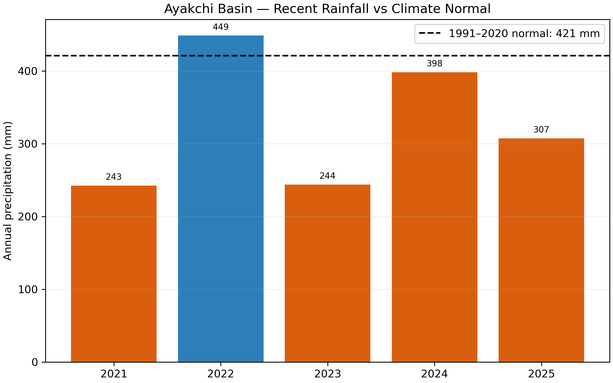
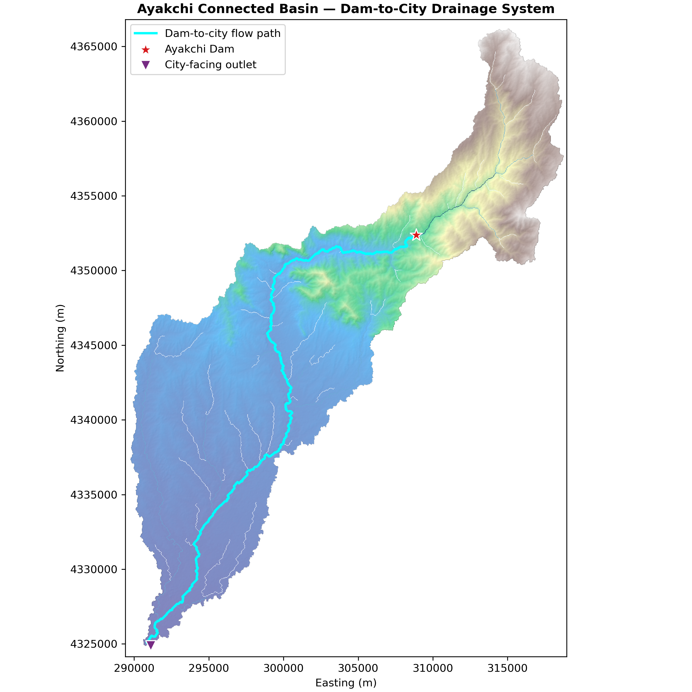
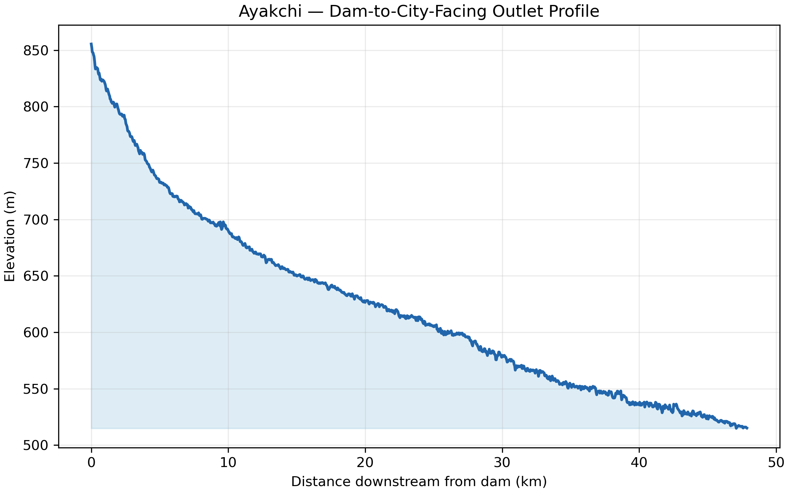
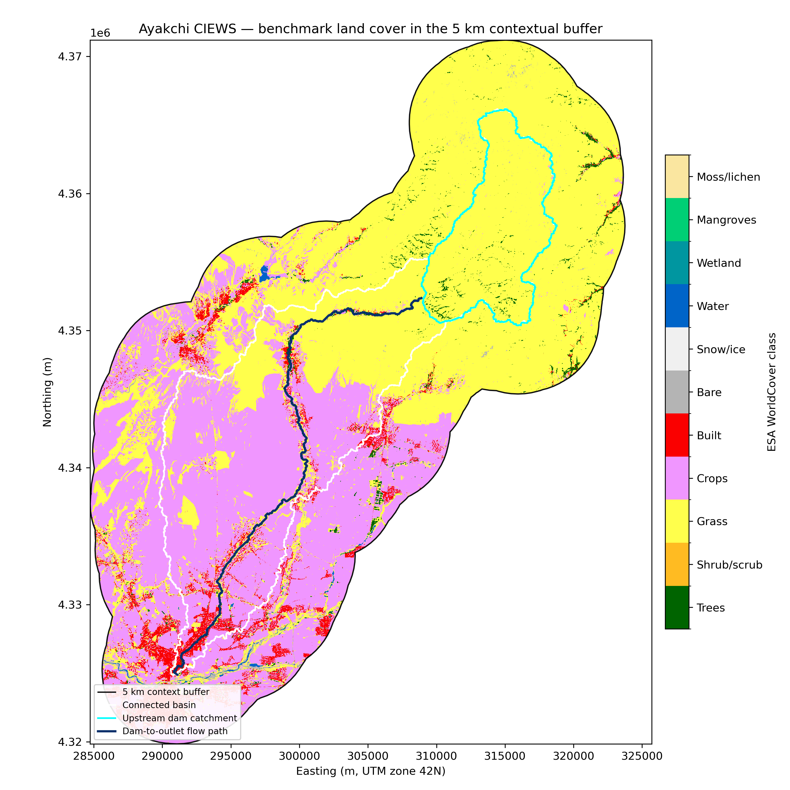
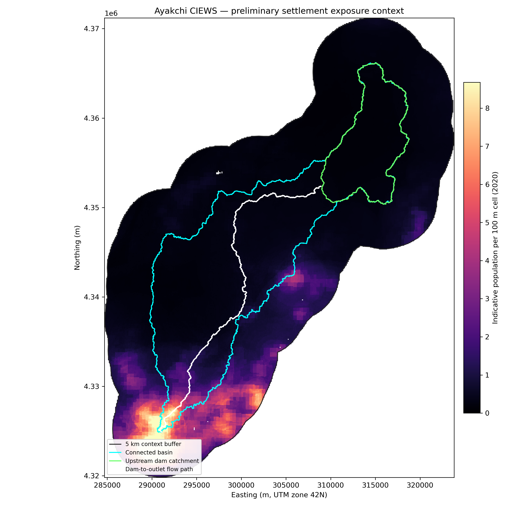
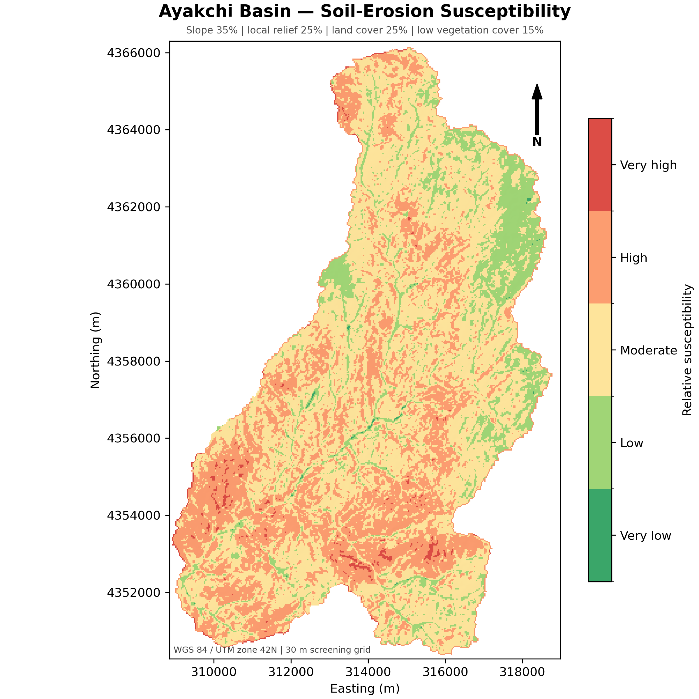
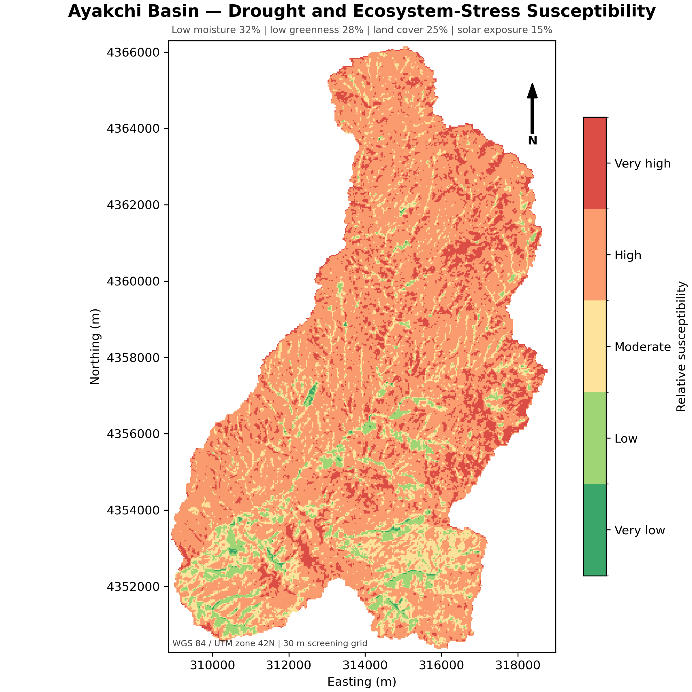
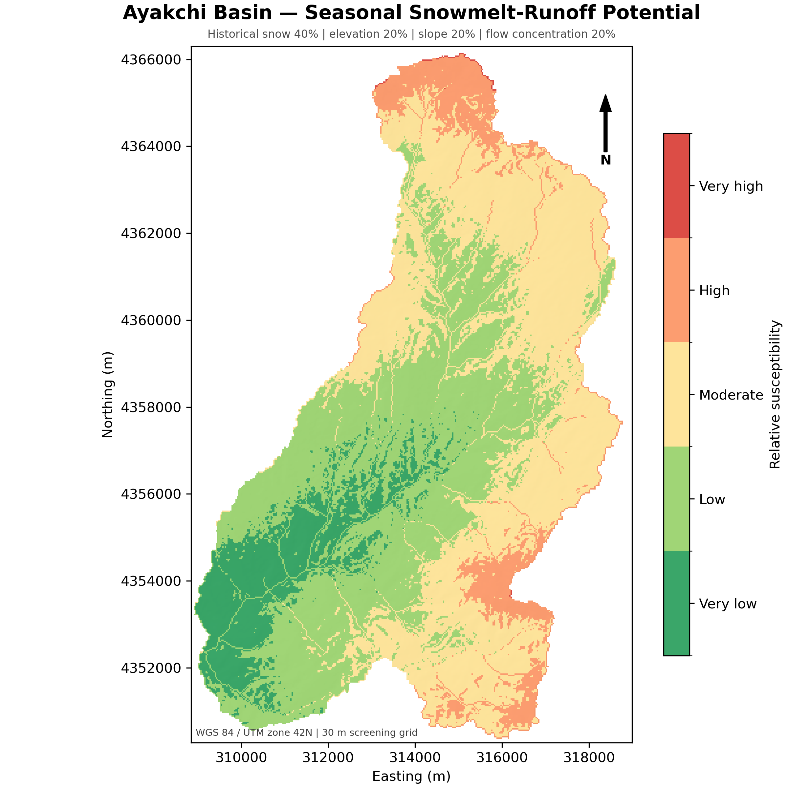

# Ayakchi Climate Information and Early Warning System

## Source-aligned concept and evidence report

**Prepared for:** CIEWS Stakeholder Mapping and Vision Setting  
**Primary reference:** *Republic of Uzbekistan: Climate Information and Early Warning Systems — Stakeholder and Landscape Mapping Report* (`57055-001-tacr-en_2.pdf`)  
**Local evidence:** Ayakchi upstream catchment, connected downstream basin, hazard, drought, land-cover, and exposure analyses  
**Status:** Draft for government and stakeholder consultation  
**Date:** 5 August 2026

---

## Executive summary

The national stakeholder and landscape mapping report defines a Climate Information and Early Warning System (CIEWS) as an **end-to-end chain from climate and hydrometeorological data to warnings and sector decisions**. It recommends a “forecast-to-field” architecture that connects Uzhydromet forecasts, Ministry of Water Resources (MoWR) operations, Ministry of Emergency Situations (MES) warning and response, Ministry of Agriculture (MoA) planning, and last-mile action through Water Supply Services (WSSs), Water User Associations (WUAs), local government, and communities.

This report applies that national concept to Ayakchi. It combines the institutional and digital architecture in the national reference with the project’s current basin evidence. It is intended to guide the stakeholder workshop, define the proposed pilot, and provide a reference for the subsequent presentation and concept design.

Ayakchi is well suited to a basin-level “forecast-to-field” pilot because it connects four decision environments:

1. an elevated **89.1 km² upstream catchment** where rainfall, snow, erosion, and terrain processes influence reservoir inflow;
2. a confirmed dam requiring climate-informed storage, release, sediment, and safety awareness;
3. a **372.8 km² connected basin**, of which approximately **76% lies below the dam** and can generate additional tributary runoff; and
4. a downstream agricultural and settlement corridor requiring water-service decisions, warnings, and protective action.

The broader 5 km contextual study area covers approximately **1,051.5 km²**. Global screening data indicate approximately **106,800 people** in this area, including about **20,900 within the connected basin** and about **27,000 within a 2 km corridor around the mapped downstream flow path**. The corridor is approximately 50% cropland and 9% built land according to ESA WorldCover. These are planning estimates, not population-at-risk or inundation results.

The existing analysis also demonstrates the need for combined drought and flood services. Mean CHIRPS rainfall during 2021–2025 was approximately **328 mm/year**, compared with a 1991–2020 normal of approximately **421 mm/year**. Annual rainfall ranged from about **243 mm** in 2021 and 2023 to about **449 mm** in 2022. The largest recent three-day rainfall total was approximately **56.3 mm**. The record is too short for frequency analysis, but it shows that Ayakchi operations must handle both scarcity and episodic high rainfall.

The national reference identifies the same system gaps that are relevant to Ayakchi: no binding cross-sector trigger matrix, irregular sector bulletins, fragmented data systems, uneven monitoring and communications redundancy, uncertain lifecycle financing, and inconsistent last-mile capacity. It specifically records stakeholder interest in an Ayakchi/Obizarang watershed and early-warning platform integrating flood, drought, sediment inflow, SCADA, telemetry, operational decision support, and community risk communication (reference document, PDF pp. 32–35).

The proposed Ayakchi pilot should therefore not create a parallel national warning system. It should become an **object- and basin-level extension** of Uzbekistan’s emerging national CIEWS architecture:

> Uzhydromet observation and forecast → Ayakchi basin and reservoir analysis → MoWR operational action → MES/SEPRS warning and coordination → WSS/WUA/local authority translation → community and farmer action → feedback and system learning

The workshop should secure agreement on the initial services, lead coordination, data providers, technical product owners, warning authority, pilot communities, trigger-development process, integration with existing national platforms, and financing for operation and maintenance.

---

## 1. Relationship to the national CIEWS reference

### 1.1 National direction

The national reference proposes modernization from a partially connected warning arrangement to a fully impact-based “forecast-to-action” and “forecast-to-field” system. Its principal recommendations are to:

- establish sector-specific watch–alert–action trigger matrices;
- issue weekly and monthly sector bulletins on a fixed schedule;
- operate a unified real-time multi-hazard dashboard;
- harmonize identifiers and data schemas across hydrometeorology, water, agriculture, metering, and cadastre systems;
- secure lifecycle funding for sensors, radar, communications, and regional centers;
- strengthen inclusive last-mile channels through WSSs, WUAs, and communities;
- introduce forecast-triggered preparedness and financing; and
- pilot the package in selected basins before national scale-up (reference document, PDF pp. 28–29).

The Ayakchi concept adopts these principles at basin and reservoir scale. It adds site-specific evidence, users, monitoring needs, products, and decisions without duplicating the authoritative responsibilities or core systems of national institutions.

### 1.2 Earlier and current dam-site status

The October 2025 meeting record in the reference document described Option 5 as the working basis, still subject at that time to geotechnical, archaeological, and government confirmation (PDF p. 32). For this report, that statement is superseded by the project’s current confirmed dam location, as communicated by the project team in August 2026. Subsequent analysis uses the confirmed Option 5 location supplied in the project spatial data.

### 1.3 Ayakchi-specific value added

The national architecture is broad. The Ayakchi pilot can demonstrate how national services become concrete operational decisions at four levels:

| Level | Ayakchi application |
|---|---|
| National | Uzhydromet forecasts and warnings; MES/SEPRS coordination; national water and climate policy |
| Sector and basin | MoWR water allocation, reservoir operation, dam safety, digital water accounting |
| District and service | WSS delivery schedules, irrigation instructions, road and infrastructure readiness |
| Community and farm | Protective action, local confirmation, water-use adjustments, impact reporting |

---

## 2. Why CIEWS is needed

### 2.1 National problem translated to Ayakchi

The reference document identifies warming, altered snow and runoff timing, increasing heat and evapotranspiration, drought, floods, flash floods, mudflows, and landslides as major national concerns. It emphasizes that even where annual rainfall changes are modest, seasonal redistribution and higher temperatures can increase both scarcity and extreme-event risk (PDF pp. 11–16 and 36–41).

At Ayakchi these concerns translate into practical management questions:

- How much water is likely to enter the reservoir this season?
- Is current storage sufficient for irrigation and other agreed uses?
- Should operating readiness change because of forecast rain, catchment wetness, snowmelt, or downstream conditions?
- Are releases likely to coincide with high tributary flows below the dam?
- Which downstream users and assets should receive an advisory or warning?
- How should WSSs and WUAs adjust delivery schedules during drought or high-flow conditions?
- Are erosion and sediment conditions likely to affect reservoir performance or infrastructure?
- Did the warning reach users, and did they understand and act on it?

### 2.2 Evidence of a dual drought–flood operating problem

The recent Ayakchi record contains both marked dryness and episodic intense rainfall:

| Indicator | Screening result | Operational implication |
|---|---:|---|
| 1991–2020 normal rainfall | 421 mm/year | Baseline for anomaly monitoring |
| 2021–2025 mean rainfall | 328 mm/year | Recent period substantially below normal |
| Driest recent year | 2021: 243 mm | Need for drought readiness and allocation support |
| Longest recent dry spell | 147 days in 2023 | Need for seasonal and sub-seasonal monitoring |
| Wettest recent year | 2022: 449 mm | Wet years remain possible within a dry sequence |
| Largest recent 3-day rainfall | 56.3 mm in 2022 | Need for short-range event readiness |
| Upstream catchment | 89.1 km² | Reservoir-inflow monitoring area |
| Incremental area below dam | 283.5 km² | Downstream tributaries require separate monitoring |

The five-year period is not sufficient for design probabilities. Its purpose is to demonstrate the need for an operational service that updates as conditions change.



*Figure 1. Recent CHIRPS precipitation compared with the 1991–2020 normal. CHIRPS is a basin-scale screening product and requires validation against national observations.*

### 2.3 Information gap

The primary gap is not the absence of maps. It is the absence of a formally agreed operational chain linking authoritative data and forecasts to specific decisions, actions, messages, and feedback. Ayakchi requires:

- access to the relevant Uzhydromet observation and forecast services;
- reservoir and SCADA information from the dam operator;
- upstream and downstream telemetry suitable for threshold development;
- an agreed trigger matrix connecting technical conditions with MoWR and MES actions;
- fixed drought and water-status products for agricultural users;
- verified settlement, infrastructure, and community information;
- inclusive communication and acknowledgement arrangements; and
- long-term responsibility and financing for operation, calibration, communications, and maintenance.

---

## 3. Ayakchi dam and study-area context

### 3.1 Hydrological setting

The confirmed dam is located at the outlet of an upstream catchment of approximately **89.1 km²**. Terrain ranges from approximately **860 m to 2,068 m**, with mean elevation around **1,538 m** and relief of approximately **1,208 m**. The analytical upstream main flow path is approximately **19.2 km**.

The connected downstream analysis extends approximately **47.9 km** from the dam to the city-facing basin outlet. The path descends approximately **340 m**. The contributing area increases from approximately **89.3 km² at the dam** to **372.8 km² at the downstream outlet**.



*Figure 2. Connected drainage system. The mapped network is terrain-derived and requires verification against surveyed channels and structures.*

### 3.2 Why downstream tributaries matter

Approximately 76% of the connected drainage area lies below the dam. Consequently:

- a low or controlled dam release does not guarantee low downstream flow;
- downstream tributary rainfall must be observed or estimated;
- warning logic must consider coincident reservoir releases and tributary peaks;
- downstream gauges should be located to distinguish main-stem and tributary contributions; and
- messages should distinguish a reservoir-related notification from a general downstream flood warning.



*Figure 3. DEM-derived downstream profile. It is not a surveyed hydraulic profile and cannot establish flood travel time.*

### 3.3 Land use and settlement context

The 5 km contextual analysis supports user and exposure mapping. It must not be presented as an inundation boundary.

| Zone | Area | Cropland | Built land | Indicative population |
|---|---:|---:|---:|---:|
| Upstream catchment | 89.1 km² | 0.2% | <0.1% | 1,609 |
| Incremental downstream area | 284.0 km² | 59.5% | 4.1% | 19,301 |
| Connected basin | 372.8 km² | 45.4% | 3.2% | 20,901 |
| 2 km flow-path corridor | 174.8 km² | 49.9% | 9.2% | 27,017 |
| Total contextual study area | 1,051.5 km² | 39.0% | 4.8% | 106,776 |

The downstream concentration of cropland, built land, and population directly supports the national reference’s emphasis on WSS, WUA, local-government, and community involvement.



*Figure 4. ESA WorldCover benchmark. Land-cover classes require local validation.*



*Figure 5. WorldPop screening estimate. This is not an official census or population-at-risk map.*

---

## 4. Preliminary findings for service design

### 4.1 Terrain, runoff, erosion, and sediment

The relative rapid-runoff screening identifies channel-concentration corridors, while erosion screening places approximately **30.5% of the upstream basin in high or very high classes**. Terrain-instability screening places approximately **15.9% in high or very high classes**. The national reference separately records sedimentation as a critical project concern and recommends sediment-yield analysis, trap-efficiency assessment, nature-based watershed measures, bathymetric baselines, and periodic monitoring for Ayakchi and Obizarang (PDF p. 32).

This supports an Ayakchi CIEWS function for **sediment and watershed condition awareness**, but operational sediment alerts require turbidity or sediment observations, rainfall and discharge data, bathymetry, and locally validated source areas.



*Figure 6. Relative erosion susceptibility—not predicted sediment yield.*

### 4.2 Drought and water availability

Approximately **80.2%** of the upstream catchment is classified as high or very high in the relative drought-stress index. This index combines recent satellite moisture and vegetation conditions with land cover and solar exposure. It does not represent an official drought stage.

The operational drought service should align with the national reference’s rolling one- to three-month water-availability outlooks and periodic hydrological/agrometeorological bulletins (PDF p. 20). At Ayakchi, the service should combine Uzhydromet information with reservoir storage, inflow, irrigation demand, delivery constraints, and WSS/WUA reports.



*Figure 7. Relative drought-stress screening for monitoring prioritization.*

### 4.3 Snowmelt and seasonal inflow

Approximately **51.0%** of the upstream catchment is classified as moderate to high in the snowmelt-runoff screening. National operations already use regional MODSNOW guidance, and the national reference recommends expanded headwater observation of snow, rainfall, and debris-flow conditions (PDF pp. 21 and 41).

Ayakchi should use national snow guidance and add local validation where it improves reservoir decisions. Candidate monitoring should be selected after confirming representativeness, access, communications, and maintenance capacity.



*Figure 8. Relative seasonal snowmelt-runoff potential.*

### 4.4 Exposure and impact information

The current buffer study identifies broad concentrations of population, agriculture, and built land. An impact-based service additionally requires verified:

- villages and neighbourhoods;
- buildings and vulnerable population groups;
- schools, clinics, government facilities, and shelters;
- roads, bridges, culverts, crossings, and evacuation routes;
- canals, intakes, pumps, and water-supply infrastructure;
- communication coverage and warning equipment; and
- historical impact locations and community accounts.

This database should use shared identifiers compatible with relevant national water, agriculture, cadastre, and emergency systems.

---

## 5. Priority hazards and affected sectors

| Priority service area | Ayakchi evidence | Principal sectors | Proposed initial status |
|---|---|---|---|
| Drought and seasonal water availability | Recent rainfall deficit; high drought-stress screening | MoWR, dam operator, WSS, WUA, agriculture, water supply | Core pilot service |
| Heavy rainfall and rapid runoff | Relief and channel concentration; intense recent multi-day rainfall | Uzhydromet, MoWR, MES, roads, settlements | Core pilot service |
| Reservoir inflow, level, release, and spillway awareness | Dam is central project component | Dam operator, MoWR, MES, downstream authorities | Core pilot service |
| Downstream tributary flood awareness | 76% of connected basin below dam | MES, local government, communities, roads, irrigation | Core pilot service |
| Snow and snowmelt awareness | Elevated headwaters; moderate/high screening | Uzhydromet, dam operator, MoWR | Core seasonal input |
| Sediment and erosion awareness | High erosion screening; reference-document concern | Dam operator, watershed managers, agriculture | Develop with observations |
| Terrain instability and mudflow awareness | Terrain screening and national hazard context | MES, roads, communities, dam access | Integrate with national service |
| Heat and agricultural demand | National CIEWS priority; downstream agriculture | MoA, WSS, WUA, farmers, health actors | Use national products initially |

The pilot should concentrate on services where Ayakchi adds basin- or reservoir-specific value. It should consume rather than recreate national heat, weather, and general hazard forecasts.

---

## 6. Proposed CIEWS functions and products

### 6.1 Forecast-to-field functions

| Function | National/system source | Ayakchi value added | Action link |
|---|---|---|---|
| Weather and climate outlook | Uzhydromet/NFCS | Catchment and reservoir interpretation | Readiness, seasonal operation, allocation |
| Hydrological monitoring | Uzhydromet and project gauges | Upstream/downstream basin state | Watch levels and situational awareness |
| Reservoir monitoring | MoWR/dam operator/SCADA | Storage, gate, release, spillway context | Operating procedure and notification |
| Agricultural water service | MoWR/MoA/Suv hisobi/CropAgro | Ayakchi availability and local delivery implications | Rotation and delivery adjustment |
| Impact assessment | MES, local authorities, sector data | Communities, assets, roads, irrigation exposure | Warning content and protective action |
| Last-mile communication | MES, WSS, WUA, local government | Local message, acknowledgement and feedback | Community and farmer action |
| Event learning | All participating institutions | Basin event archive and performance review | Threshold and procedure improvement |

### 6.2 Initial product suite

| Product | Content | Cadence | Owner to confirm |
|---|---|---|---|
| Ayakchi operational dashboard | Forecasts, rainfall, snow, upstream/downstream stage, reservoir level, release, system health | Near real time | MoWR platform operator with data owners |
| Weekly basin and reservoir bulletin | Recent conditions, forecast, storage trend, data status, operational concerns | Weekly | Joint technical product |
| Monthly drought and water-status bulletin | Rainfall, snow, soil moisture, vegetation, storage, demand and service implications | Monthly | MoWR/MoA with Uzhydromet input |
| Seasonal Ayakchi outlook | National outlook translated into inflow, storage, allocation and agricultural scenarios | Key planning seasons | Uzhydromet and MoWR |
| Heavy-rainfall/rapid-runoff watch | Uzhydromet forecast plus Ayakchi wetness, channels, reservoir and downstream context | Event driven | Uzhydromet/MoWR technical chain |
| Reservoir release notification | Planned or emergency release, timing, rate, downstream notification status | Event driven | Dam operator/MoWR under approved SOP |
| Downstream impact-based warning | Expected condition, location, timing, confidence, impact and action | Event driven | Authorized MES/SEPRS chain |
| Sediment/watershed condition note | Rainfall/flow/turbidity indicators, erosion observations, reservoir implications | Event/seasonal | Dam and watershed technical team |
| Post-event review | Data, forecasts, decisions, warnings, actions, impacts and lessons | After significant event | CIEWS governance group |

Products should have agreed service levels: issuance time, update frequency, data cutoff, approval time, distribution list, backup producer, and archive requirements.

---

## 7. Users, institutions, and decisions

The national reference provides a clearer basis for assigning functions than the earlier generic role map.

| Institution/user | Reference-document role | Ayakchi decision responsibility |
|---|---|---|
| Uzhydromet | National monitoring, forecasting, and hydrometeorological warning authority | Provide authoritative observations, forecasts, watches, warnings, and technical inputs |
| MoWR | Reservoir/canal operation, dam safety, water allocation, digital water management | Operate Ayakchi reservoir; translate forecasts into operating and allocation decisions |
| Dam owner/operator | Reservoir and SCADA operation under MoWR arrangements | Monitor level, gates, release and structures; execute approved SOPs; notify conditions |
| MES/SEPRS | Public warning, incident command, evacuation, road closure, life safety | Authorize/coordinate impact-based warning and protective response according to mandate |
| MoA and agricultural services | Crop planning and agrometeorological use | Translate water and climate information into crop and farm guidance |
| WSS | District/city water delivery and last-mile data | Adjust delivery schedules and communicate practical water instructions |
| WUA | On-farm distribution and local coordination | Translate service information into local schedules and farmer action |
| Regional/district authorities | Local coordination and public communication | Confirm local conditions, coordinate services and support dissemination |
| Roads and infrastructure operators | Protect transport and critical assets | Inspect, restrict, close, or restore affected assets |
| Communities and farmers | Act on warnings and water guidance | Protect life/assets, adjust practices, acknowledge and report impacts |
| NCECC/NFCS coordination | National climate-service policy and coordination | Ensure alignment with national climate-services development |

Final authority and accountability must be confirmed against current legal mandates and recorded in the workshop decision matrix.

---

## 8. Monitoring and data architecture

### 8.1 Build on existing systems

The reference document identifies existing Uzhydromet portals and modelling, MoWR’s Suv hisobi and planned Situation Center, State Water Cadastre, pump-meter integration, satellite monitoring, MoA’s CropAgro/Agroplatforma, MES systems, and the UNDP/Uzhydromet GIS risk platform. It also records a three-layer concept—central, regional, and potential object/site level—with room to extend object-level capability to reservoirs (PDF p. 34).

Ayakchi should be designed as that object/site and basin layer. A separate, isolated platform would increase fragmentation.

```text
Uzhydromet observations, forecasts and warnings
                         │
National and regional CIEWS / MES / MoWR systems
                         │
          Ayakchi basin and reservoir service
       ┌─────────────────┼──────────────────┐
       │                 │                  │
Upstream gauges      Reservoir/SCADA   Downstream gauges
       │                 │                  │
       └──────── analysis, triggers and products ────────┐
                                                         │
           MoWR operation ───── MES/SEPRS warning        │
                  │                    │                  │
             WSS/WUA/local authorities/community feedback
```

### 8.2 Immediate data request

The reference document records Uzhydromet’s request for a precise specification of variables, coverage, temporal resolution, and delivery formats (PDF p. 33). The Ayakchi request should cover, at minimum:

- historical and near-real-time precipitation and temperature;
- snow observations and relevant MODSNOW products;
- river stage and discharge at relevant stations;
- historical warnings and event records;
- available radar, nowcast, COSMO-CA, CARFFGS, and hydrological products;
- metadata, quality flags, station changes, and data latency; and
- terms for operational system access distinct from one-time feasibility-study archives.

### 8.3 Monitoring gap assessment

Candidate new or upgraded monitoring should include representative upper-catchment precipitation/temperature, upstream flow, reservoir level and release, priority downstream tributaries, and exposed downstream reaches. Sediment/turbidity, cameras, snow, soil moisture, or debris-flow sensors should be added only where they support an agreed decision and can be maintained.

Site selection criteria should include hydrological representativeness, user lead time, exposure, access, security, power, communications, maintenance, calibration, and compatibility with national standards.

### 8.4 Data governance

The pilot should demonstrate:

- common station, asset, intake, parcel, and community identifiers;
- documented units, datum, timestamps, quality flags, and latency;
- authoritative ownership with controlled operational sharing;
- application programming interfaces or standard exports;
- warning and decision audit trails;
- outage notification and fallback procedures;
- cybersecurity and role-based access; and
- lifecycle budgets for equipment, calibration, communications, software, staff, and replacement.

---

## 9. Warning and action chain

### 9.1 Proposed Ayakchi chain

1. **Uzhydromet detects or forecasts** hazardous weather, hydrological drought, snowmelt, or other relevant conditions.
2. **Ayakchi monitoring adds local context** from catchment, reservoir, downstream, and field observations.
3. **Technical producers assess a shared trigger matrix** and document confidence, affected area, and likely impacts.
4. **MoWR/dam operator executes authorized operational actions** under approved rules and SOPs.
5. **MES/SEPRS issues or coordinates public warnings and protective guidance** according to mandate.
6. **WSS, WUA, local authorities, and sector operators translate the message** into delivery schedules, road actions, community instructions, and farm decisions.
7. **Recipients acknowledge and act**, using primary and backup communication channels.
8. **Field conditions and impacts return to the platform**, allowing update, escalation, all-clear, and post-event review.

### 9.2 Trigger-matrix template

| Level | Example evidence | Technical interpretation | MoWR/operator action | MES/local action | User message |
|---|---|---|---|---|---|
| Normal | Conditions within seasonal range | Routine monitoring | Normal operation | Routine readiness | Regular bulletin |
| Watch | Forecast or observed anomaly developing | Increased possibility; uncertainty remains | Increase monitoring; review storage/release readiness | Notify focal points; verify contacts | Awareness and preparedness |
| Alert | Threshold approached/exceeded with plausible impacts | Event likely or underway | Execute approved operational step; report status | Prepare/issue targeted warning and protective action | What, where, when, what to do |
| Emergency | Severe observed condition or failure scenario | Immediate life-safety concern | Emergency SOP and continuous reporting | Incident command, evacuation/closure as authorized | Immediate protective instruction |
| Recovery/all-clear | Condition receding and verified | Residual risks assessed | Stabilize operations and inspect | All-clear/recovery coordination | Safe return and continuing precautions |

Numerical thresholds must not be assigned from the current screening analysis. They require approved operating rules, national criteria, observations, model calibration, documented impacts, testing, and competent authority approval.

### 9.3 Inclusive last mile

Consistent with the national reference, Ayakchi dissemination should combine SMS and official digital channels with TV/radio where relevant, WSS/WUA and district messaging, local radio, siren/public-address systems where justified, and USSD/IVR or pictogram/plain-language formats for users with limited connectivity or literacy. Warning design must include women, older people, persons with disabilities, seasonal workers, remote households, and people without smartphones.

---

## 10. Phased implementation

### Phase 0 — Government agreement and pilot definition, 0–3 months

- confirm Ayakchi pilot objectives, services, users, and geographic coverage;
- approve the institutional and warning-authority matrix;
- establish the Uzhydromet data request and government access pathway;
- inventory existing stations, SCADA, platforms, communications, and procedures;
- validate settlements, assets, WSS/WUA structure, and community channels; and
- agree platform-integration principles and performance indicators.

**Decision gate:** endorsed pilot charter, named accountable organizations, and minimum data access.

### Phase 1 — Minimum operational information service, 3–9 months

- connect available Uzhydromet, reservoir, forecast, satellite, and field information;
- establish an internal Ayakchi dashboard within or interoperable with existing platforms;
- pilot weekly basin/reservoir and monthly drought/water bulletins;
- establish shared contacts, message templates, and event logs;
- document provisional qualitative triggers and SOP links; and
- conduct data-loss, tabletop, and communication tests.

**Decision gate:** reliable routine products and demonstrated end-to-end test communication.

### Phase 2 — Monitoring and pilot action service, 6–18 months

- rehabilitate or install priority upstream, reservoir, tributary, and downstream monitoring;
- implement quality control, telemetry health, calibration, and maintenance routines;
- create a verified event and exposure database;
- pilot watch–alert–action matrices with selected users and communities;
- integrate WSS/WUA water-service decisions and acknowledgement; and
- complete after-action reviews with measurable corrective actions.

**Decision gate:** monitoring reliability and evidence that users receive, understand, and act on services.

### Phase 3 — Calibrated models and formal thresholds, 12–30 months

- calibrate hydrological and reservoir-inflow models;
- survey priority downstream channels and structures;
- develop hydraulic or sediment models where decisions justify them;
- establish validated lead times and impact-based thresholds;
- approve formal cross-institution SOPs and service levels; and
- independently review technical performance and safety-critical use.

**Decision gate:** approved models, thresholds, SOPs, and sustainable operational financing.

### Phase 4 — Consolidation and scale-up, from 24 months

- integrate lessons into national CIEWS/NFCS, MoWR, MES, and agricultural systems;
- expand to other reservoirs or basins only after performance review;
- institutionalize training, exercises, budgets, and replacement cycles; and
- maintain joint learning with relevant regional and national programmes.

---

## 11. Decisions requested from government

| Required decision | Specific Ayakchi question |
|---|---|
| Pilot purpose | Which decisions must demonstrably improve in the first phase? |
| Lead coordination | Which organization is accountable for the Ayakchi pilot and inter-agency delivery? |
| Platform approach | Which existing national/MoWR/MES platform will host or interoperate with the Ayakchi object layer? |
| Technical product ownership | Who produces each dashboard, bulletin, watch, and reservoir notification? |
| Warning authority | Who authorizes public warnings, updates, and all-clear messages, including backups? |
| Data sharing | Which Uzhydromet, MoWR, dam, WSS, MoA, MES, and local datasets will be available and at what latency? |
| Initial users | Which WSSs, WUAs, communities, roads, and service providers form the pilot? |
| Trigger process | Which working group will develop and approve the watch–alert–action matrix? |
| Monitoring investment | Which decisions and gaps justify new stations or telemetry? |
| Last-mile channels | Which primary and backup channels reach all target users? |
| Financing | Who funds operation, calibration, communications, software, staff, maintenance, and replacement? |
| Performance | Which indicators determine whether the pilot should be scaled? |

Recommended pilot indicators, adapted from the national reference, include product timeliness, data availability, warning lead-time utilization, warning acknowledgement, share of water-service decisions informed by CIEWS, difference between observed/metered and fallback estimates, user comprehension, equipment uptime, and quality/completion of after-action reviews.

---

## 12. Agreed actions and responsibilities

| Immediate action | Proposed lead for confirmation | Supporting parties | Timing after workshop |
|---|---|---|---|
| Approve Ayakchi pilot charter and governance | MoWR/project governance | Uzhydromet, MES, MoA, NCECC/NFCS, local authorities | 2–4 weeks |
| Issue precise hydrometeorological data request | Ayakchi technical lead/MoWR | Uzhydromet and project consultants | 2 weeks |
| Inventory stations, SCADA, communications and platforms | Joint technical team | All asset and data owners | 1–2 months |
| Confirm initial products and service levels | Product owners | User representatives | 1–2 months |
| Map WSS, WUA, community and infrastructure users | Regional/district coordination | MoWR, MES, MoA and local stakeholders | 1–3 months |
| Validate exposure and historical events | MES/local authorities | Communities, road, irrigation and service operators | 1–3 months |
| Draft data-sharing and identifier protocol | Lead coordinator | Data owners, legal and IT teams | 2–3 months |
| Draft Ayakchi trigger matrix and SOP links | Uzhydromet–MoWR–MES working group | MoA, WSS, local authorities | 2–4 months |
| Prototype dashboard and bulletins | Platform/technical operator | Product owners and users | 2–4 months |
| Prepare monitoring gap and lifecycle-cost plan | Technical lead | Operators and maintenance teams | 3–5 months |
| Conduct first end-to-end tabletop exercise | MES/SEPRS with pilot lead | Entire warning and action chain | Within 6 months |
| Review pilot performance and authorize next phase | Pilot governance group | Users and independent technical review | 9–12 months |

---

## 13. Presentation implications

The presentation based on this report should make three ideas explicit:

1. **Ayakchi is not a stand-alone software project.** It is an object- and basin-level implementation of Uzbekistan’s national forecast-to-field CIEWS direction.
2. **The dam is central but not the only hydrological control.** Most of the connected basin lies below the dam, requiring tributary monitoring and a separate downstream warning view.
3. **Success is measured by decisions and action.** The dashboard, stations, models, and maps are enabling components; success is timely water operations, warnings, protective action, and learning.

Suggested presentation sequence:

1. National CIEWS direction and workshop purpose
2. Why Ayakchi is an appropriate pilot
3. Confirmed dam and nested study areas
4. Upstream catchment and reservoir context
5. Downstream tributary contribution
6. Agriculture, settlements, and population context
7. Drought and hydroclimate findings
8. Runoff, erosion, sediment, and snowmelt findings
9. Priority services and users
10. National-to-Ayakchi forecast-to-field architecture
11. Proposed products and cadence
12. Monitoring and platform integration
13. Trigger matrix and warning chain
14. Institutional responsibilities
15. Phased pilot roadmap
16. Government decisions requested
17. Immediate actions and owners

---

## 14. Limitations and evidence status

- The national reference provides the institutional baseline as of its preparation; current legal mandates and organizational names should be confirmed by government.
- The earlier conditional status of Option 5 in the October 2025 meeting record has been superseded by the project team’s current confirmation.
- Hazard maps are relative susceptibility products, not calibrated probabilities or forecasts.
- The 5 km buffer and 2 km corridor are contextual planning zones, not inundation or dam-break boundaries.
- The downstream distance bands and DEM profile do not provide hydraulic travel times or flood depths.
- CHIRPS, ERA5-Land, WorldPop, ESA WorldCover, GHSL, Dynamic World, MODIS, and other global products require local validation.
- Gross rainfall volume and ERA5 runoff are not routed reservoir inflow or design-flood estimates.
- Population estimates are not official census counts or population-at-risk estimates.
- Numerical triggers require observations, operating rules, calibrated models, impact records, testing, and authority approval.
- Dam-safety, emergency-action, design-flood, hydraulic, geotechnical, and sediment-management studies remain separate professional workstreams that CIEWS may support but cannot replace.

---

## Appendix A. Source alignment matrix

| National reference theme | Source location | Ayakchi application |
|---|---|---|
| CIEWS as end-to-end forecast-to-field chain | PDF pp. 5–9 | Basin/reservoir service linked to operational and community decisions |
| Uzhydromet monitoring, forecasts and warnings | PDF pp. 18–21 | Authoritative upstream weather, climate and hydrological inputs |
| MoWR reservoir, canal and dam-safety operation | PDF p. 18 | Reservoir operation and water-allocation actions |
| MES/SEPRS warning and response | PDF pp. 18, 22–23 | Public warning, protective action and incident coordination |
| WSS/WUA last-mile water decisions | PDF pp. 22–23 | Delivery schedules, farmer instructions and feedback |
| Suv hisobi, cadastre and water digitalization | PDF pp. 21 and 24–26 | Data and platform interoperability |
| CropAgro/Agroplatforma | PDF pp. 8 and 24–26 | Agricultural decision channel |
| Trigger matrices and fixed bulletins | PDF pp. 28–29 | Ayakchi watch–alert–action matrix and scheduled products |
| Unified multi-hazard dashboard | PDF pp. 23 and 28–29 | Integrated Ayakchi object/basin view |
| Inclusive last-mile channels | PDF pp. 23 and 28–29 | Redundant, accessible community and farmer communication |
| Ayakchi watershed/EWS platform interest | PDF pp. 32–35 | Direct basis for proposed pilot functions |
| Flood/drought/sediment reservoir focus | PDF pp. 32–35 | Initial operational product scope |
| Two-basin pilot direction | PDF p. 35 | Ayakchi/Obizarang programme alignment |

## Appendix B. Local analytical evidence

| Evidence | Project output |
|---|---|
| Upstream catchment and morphology | `hydromorphology_outputs/` |
| Downstream drainage and profile | `downstream_analysis_outputs/` |
| Environmental and climate data provenance | `gee_environmental_data/manifest.json` |
| Drought and rainfall screening | `drought_dam_outputs/` |
| Hazard screening and methodology | `hazard_screening_outputs/` |
| Buffer, land cover, built surface and population | `buffer_zone_outputs/` |
| Earlier detailed technical reference | `CIEWS_REFERENCE_REPORT.md` |

